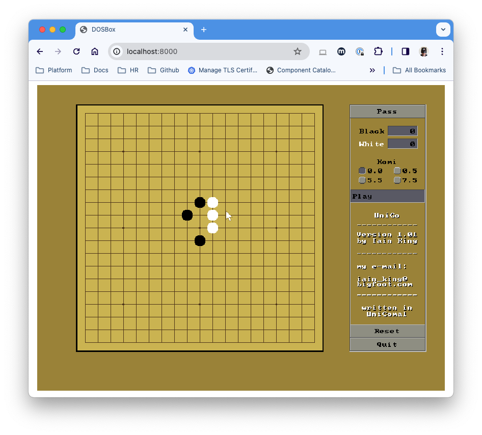

# unicomal
Unicomal Running in DOSBOX with a web front end

## POC
create a docker image with an included example comal file (the game of go by Iain King)
This runs a javascript dosbox emulator which installs comal and the game into the browser!

You can then play the game of go in your browser.

### Run it yourself
```
docker build . -t unicomal-go
docker run -p 8000:8000 unicomal-go
```

Then point your browser at http://localhost:8000


